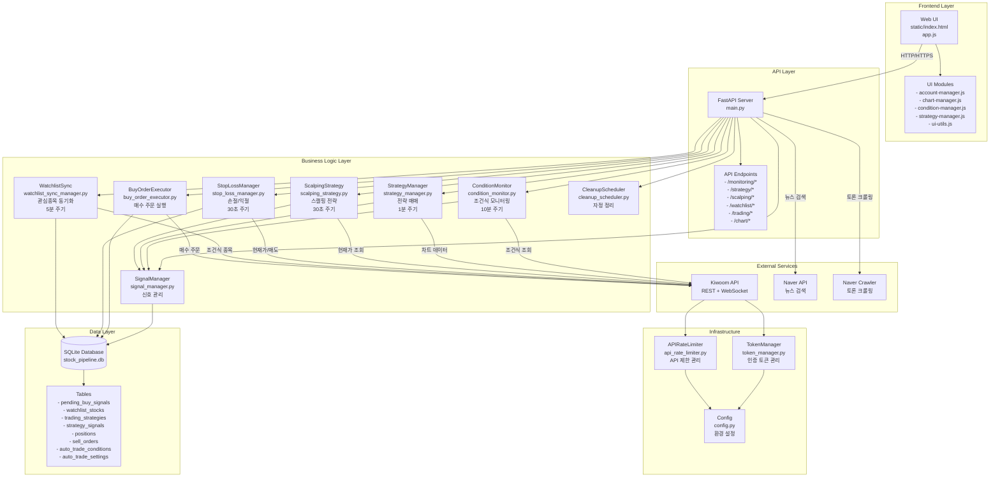
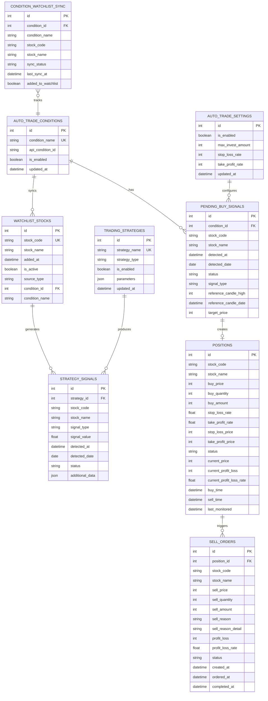
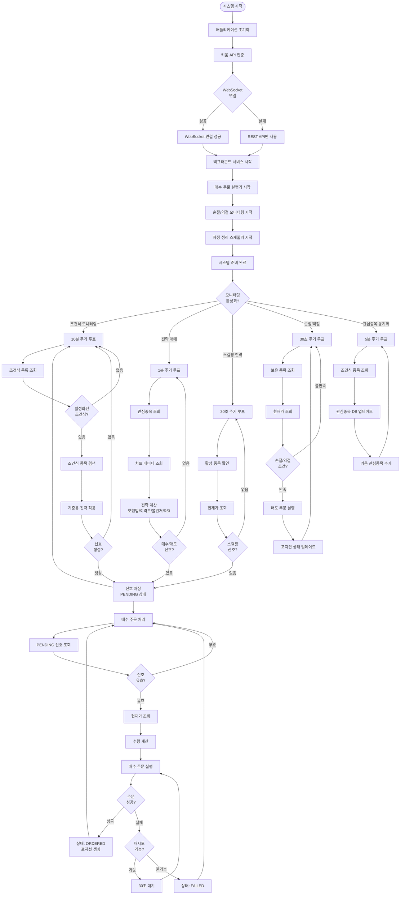
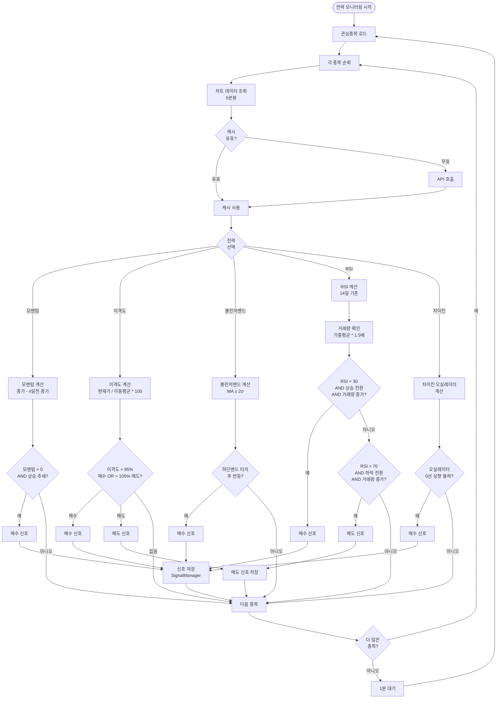
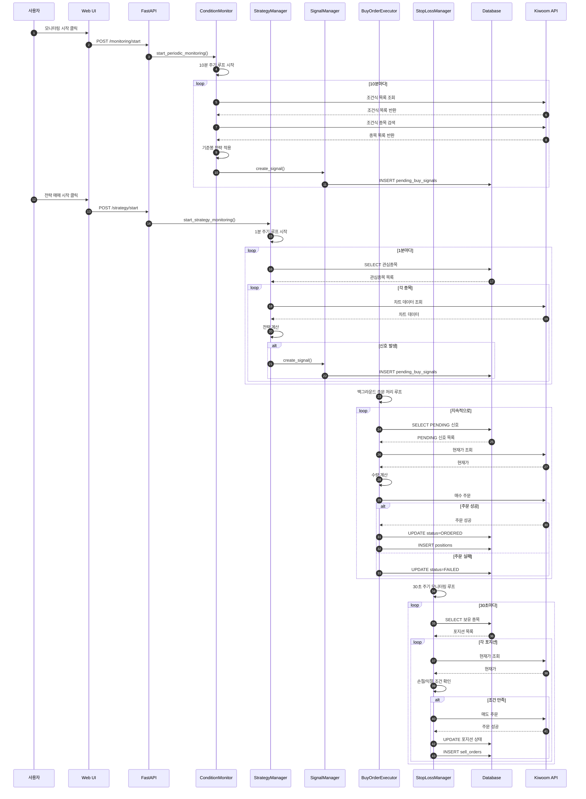
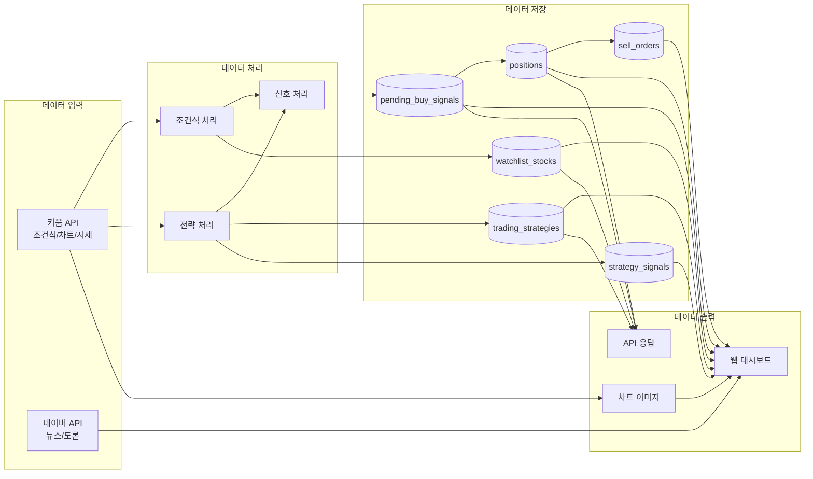

# 키움증권 자동매매 시스템 아키텍처 다이어그램

## 1. 시스템 전체 아키텍처



## 2. 데이터베이스 ER 다이어그램



## 3. 프로세스 플로우 다이어그램



## 4. 전략별 매매 로직 플로우



## 5. API 엔드포인트 구조

```mermaid
graph LR
    API[FastAPI Server] --> MON[모니터링 API]
    API --> STRAT[전략 API]
    API --> SCALP[스캘핑 API]
    API --> WATCH[관심종목 API]
    API --> TRADE[매매 API]
    API --> CHART[차트 API]
    API --> ACCOUNT[계좌 API]
    API --> SIGNAL[신호 API]

    MON --> MON1[POST /monitoring/start]
    MON --> MON2[POST /monitoring/stop]
    MON --> MON3[GET /monitoring/status]

    STRAT --> STRAT1[POST /strategy/start]
    STRAT --> STRAT2[POST /strategy/stop]
    STRAT --> STRAT3[GET /strategy/status]
    STRAT --> STRAT4[GET /strategies/]
    STRAT --> STRAT5[POST /strategies/{type}/configure]

    SCALP --> SCALP1[POST /scalping/start]
    SCALP --> SCALP2[POST /scalping/stop]
    SCALP --> SCALP3[GET /scalping/status]

    WATCH --> WATCH1[GET /watchlist/]
    WATCH --> WATCH2[POST /watchlist/add]
    WATCH --> WATCH3[DELETE /watchlist/{code}]
    WATCH --> WATCH4[POST /watchlist/sync/start]

    TRADE --> TRADE1[POST /trading/buy]
    TRADE --> TRADE2[GET /trading/settings]
    TRADE --> TRADE3[POST /trading/settings]
    TRADE --> TRADE4[GET /positions/]

    CHART --> CHART1[GET /chart/image/{code}]
    CHART --> CHART2[GET /chart/strategy/{code}/{type}]
    CHART --> CHART3[GET /stocks/{code}/info]

    ACCOUNT --> ACC1[GET /account/balance]
    ACCOUNT --> ACC2[GET /account/holdings]
    ACCOUNT --> ACC3[GET /account/profit]

    SIGNAL --> SIG1[GET /signals/pending]
    SIGNAL --> SIG2[GET /signals/statistics]
    SIGNAL --> SIG3[GET /signals/by-strategy/{id}]
```

## 6. 컴포넌트 상호작용 시퀀스



## 7. 데이터 흐름도



## 8. 모니터링 주기 및 타이밍

```mermaid
gantt
    title 시스템 모니터링 주기
    dateFormat X
    axisFormat %s초

    section 조건식 모니터링
    조건식 스캔 (10분 주기)    :0, 600s
    조건식 스캔 (10분 주기)    :600, 600s
    조건식 스캔 (10분 주기)    :1200, 600s

    section 전략 매매
    전략 스캔 (1분 주기)       :0, 60s
    전략 스캔 (1분 주기)       :60, 60s
    전략 스캔 (1분 주기)       :120, 60s

    section 스캘핑 전략
    스캘핑 스캔 (30초 주기)    :0, 30s
    스캘핑 스캔 (30초 주기)    :30, 30s
    스캘핑 스캔 (30초 주기)    :60, 30s

    section 손절/익절
    손절/익절 모니터링 (30초 주기) :0, 30s
    손절/익절 모니터링 (30초 주기) :30, 30s
    손절/익절 모니터링 (30초 주기) :60, 30s

    section 관심종목 동기화
    동기화 (5분 주기)          :0, 300s
    동기화 (5분 주기)          :300, 300s
    동기화 (5분 주기)          :600, 300s
```



## 주요 컴포넌트 설명

### 백엔드 컴포넌트
- **main.py**: FastAPI 서버, 모든 API 엔드포인트 정의
- **condition_monitor.py**: 키움 조건식 모니터링 (10분 주기)
- **strategy_manager.py**: 전략 매매 관리 (모멘텀, 이격도, 볼린저밴드, RSI)
- **scalping_strategy.py**: 스캘핑 전략 관리 (30초 주기)
- **stop_loss_manager.py**: 손절/익절 자동화 (30초 주기)
- **watchlist_sync_manager.py**: 조건식-관심종목 동기화 (5분 주기)
- **signal_manager.py**: 신호 중복 방지 및 관리
- **buy_order_executor.py**: 매수 주문 자동 실행
- **kiwoom_api.py**: 키움 API 연동 (REST + WebSocket)
- **api_rate_limiter.py**: API 호출 제한 관리
- **token_manager.py**: 인증 토큰 관리

### 프론트엔드 컴포넌트
- **index.html**: 메인 대시보드
- **app.js**: 메인 애플리케이션 로직
- **modules/**: UI 모듈들 (계좌, 차트, 조건식, 전략, 유틸리티)

### 데이터베이스
- **SQLite**: 모든 데이터 영구 저장
- **8개 주요 테이블**: 신호, 관심종목, 전략, 포지션, 매도주문 등

