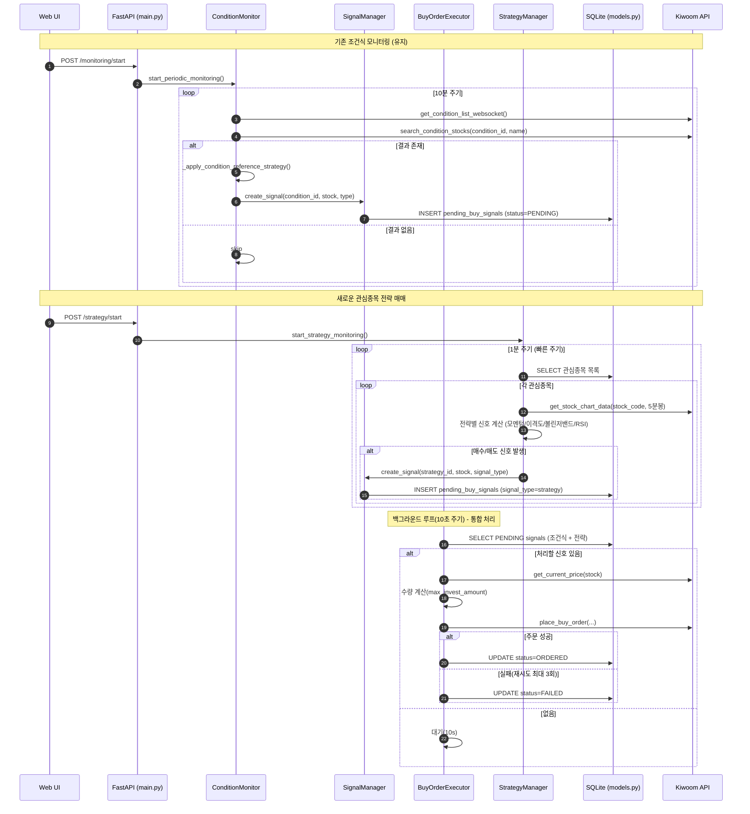
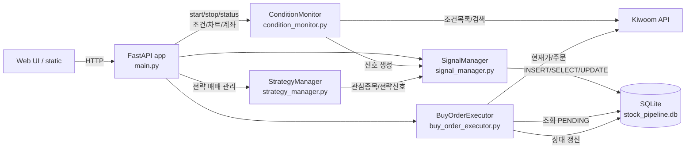

## 시스템 데이터/프로세스 흐름 개요

- **주요 컴포넌트**
  - `main.py`: FastAPI 서버 및 엔드포인트, 앱 수명주기, 정적 리소스 제공
  - `condition_monitor.py`: 조건식 주기 스캔, 기준봉 전략, 신호 생성
  - `signal_manager.py`: 신호 중복 방지, DB 저장/통계, 상태 업데이트
  - `buy_order_executor.py`: PENDING 신호 처리, 검증/주문/재시도, 상태 갱신
  - `strategy_manager.py`: 관심종목 기반 전략 매매 관리 (모멘텀, 이격도, 볼린저밴드, RSI)
    - 차트 데이터 캐싱(5분), API 제한 감지 시 스킵, 중복 호출 방지
  - `models.py`: SQLite/SQLAlchemy 모델 및 세션, 테이블 초기화
  - `kiwoom_api.py`: 키움 API 인증/차트/시세/주문 호출 (REST/WebSocket)

---

## 상위 수준 시퀀스 (조건식 모니터링 + 관심종목 전략 매매)

---

## 컴포넌트 간 데이터 흐름 (C4/컨텍스트 관점)

---

## 데이터 모델 스냅샷

### 기존 테이블 (유지)
- `pending_buy_signals`
  - id, condition_id, stock_code, stock_name, detected_at, status(PENDING/ORDERED/FAILED/...), signal_type(condition/reference/strategy)
  - reference_candle_high, reference_candle_date, target_price
  - Unique: (detected_date, condition_id, stock_code)

- `auto_trade_conditions`
  - id, condition_name(UNIQUE), api_condition_id, is_enabled, updated_at

- `auto_trade_settings`
  - id, is_enabled, max_invest_amount, stop_loss_rate, take_profit_rate, updated_at

### 새로운 테이블
- `watchlist_stocks` (관심종목)
  - id, stock_code, stock_name, added_at, is_active, notes
  - Unique: (stock_code)

- `trading_strategies` (매매 전략 설정)
  - id, strategy_name, strategy_type(MOMENTUM/DISPARITY/BOLLINGER/RSI), is_enabled, parameters(JSON), updated_at
  - Unique: (strategy_name)

- `strategy_signals` (전략별 신호 히스토리)
  - id, strategy_id, stock_code, signal_type(BUY/SELL), signal_value, detected_at, status(ACTIVE/EXPIRED/EXECUTED)
  - Unique: (strategy_id, stock_code, detected_at)

---

## 주요 엔드포인트와 내부 처리

### 기존 모니터링 관리 (유지)
- **POST /monitoring/start**: `ConditionMonitor.start_periodic_monitoring` 시작 → 10분 간격 스캔 → 신호 생성
- **POST /monitoring/stop**: 모니터링 중지 및 WebSocket 종료
- **GET /monitoring/status**: 통합 상태 조회 (모니터링/신호/API제한/실행기 상태)

### 새로운 전략 매매 관리
- **POST /strategy/start**: `StrategyManager.start_strategy_monitoring` 시작 → 1분 간격 스캔 → 전략 신호 생성
- **POST /strategy/stop**: 전략 모니터링 중지
- **GET /strategy/status**: 전략 모니터링 상태 조회

### 관심종목 관리
- **GET /watchlist/**: 관심종목 목록 조회
- **POST /watchlist/add**: 관심종목 추가
- **DELETE /watchlist/{stock_code}**: 관심종목 제거
- **PUT /watchlist/{stock_code}/toggle**: 관심종목 활성화/비활성화

### 전략 설정 관리
- **GET /strategies/**: 전략 목록 조회
- **POST /strategies/{strategy_type}/configure**: 전략 파라미터 설정
- **PUT /strategies/{strategy_id}/toggle**: 전략 활성화/비활성화

### 신호 관리 (확장)
- **GET /signals/pending**: DB에서 신호 조회 + 실시간 현재가 보강 (조건식 + 전략)
- **GET /signals/statistics**: 신호 통계 및 히스토리 조회
- **GET /signals/by-strategy/{strategy_id}**: 특정 전략의 신호 조회

### 조건식 관리 (유지)
- **GET /conditions/**: 조건식 목록 조회 (키움 API)
- **GET /conditions/{id}/stocks**: 특정 조건식의 종목 조회
- **POST /conditions/toggle**: 조건식 활성화/비활성화 토글

### 자동매매 설정 (유지)
- **GET /trading/settings**: 자동매매 설정 조회
- **POST /trading/settings**: 자동매매 설정 업데이트
- **GET /buy-executor/status**: 백그라운드 주문 실행기 상태/제어

### 차트 및 분석 (확장)
- **GET /chart/image/{stock_code}**: 종목 차트 이미지 생성 (기존 + 전략 지표)
- **GET /chart/strategy/{stock_code}/{strategy_type}**: 특정 전략 지표 차트
- **GET /chart/strategy/{stock_code}**: 모든 전략 지표 종합 차트
- **GET /kiwoom/account**: 계좌 정보 조회
- **GET /kiwoom/balance**: 잔고 조회
- **GET /stocks/{stock_code}/info**: 종목 정보 및 토론 크롤링

### 시스템 상태 (유지)
- **GET /api/status**: API 연결 상태 체크
- **GET /api/rate-limit-status**: API 제한 상태 상세 조회

---

## 전략별 매매 로직

### 1. 모멘텀 전략 (MOMENTUM)
- **공식**: `모멘텀 = 당일 종가 - n일 전 종가`
- **매수 조건**: 모멘텀 > 0 (0선 상향 돌파) AND 모멘텀 상승 추세
- **매도 조건**: 모멘텀 < 0 (0선 하향 돌파) AND 모멘텀 하락 추세
- **파라미터**: 모멘텀 계산 기간(n일), 추세 확인 기간(3일)

### 2. 이격도 전략 (DISPARITY)
- **매수 조건**: 이격도 < 95% (현재가가 이동평균 대비 5% 이상 낮음)
- **매도 조건**: 이격도 > 105% (현재가가 이동평균 대비 5% 이상 높음)
- **파라미터**: 이동평균 기간(20), 매수 임계값(95%), 매도 임계값(105%)

### 3. 볼린저밴드 전략 (BOLLINGER)
- **매수 조건**: 현재가가 하단밴드 터치 후 반등
- **매도 조건**: 현재가가 상단밴드 터치 후 하락
- **파라미터**: 이동평균 기간(20), 표준편차 배수(2), 반등 확인 기간(3일)

### 4. RSI 전략 (RSI)
- **매수 조건**: RSI < 30 (과매도) AND RSI 상승 전환
- **매도 조건**: RSI > 70 (과매수) AND RSI 하락 전환
- **파라미터**: RSI 기간(14), 과매도 임계값(30), 과매수 임계값(70)

---

## 에러/레이트리미트 고려사항

- `api_rate_limiter`: API 호출 가용성 확인/기록, 429/제한 시 딜레이 및 일부 작업 스킵
  - 호출 한도: 1분 60회, 최소 간격 1.0초 (전략매매에 맞게 튜닝)
  - 상태: NORMAL/WARNING/LIMITED/RECOVERING, 제한 시 최대 10분 대기
- `ConditionMonitor` 기준봉 전략: 데이터 부족/제한 시 스킵 및 재시도 지연
- `StrategyManager` 전략 계산: 차트 데이터 부족 시 스킵, 계산 오류 시 로그 기록
  - 차트 데이터 5분 캐시, 동일 종목 반복 조회 최소화
  - API 제한 감지 시 조회 건너뜀 후 다음 루프로 복귀
- `BuyOrderExecutor` 주문: 실패 시 최대 3회 재시도, 간격 30초

---

## 로그/운영 포인트

- 앱 수명주기에서: 인증 → WebSocket 연결 시도 → `BuyOrderExecutor` 시작 → `StrategyManager` 시작 → 종료 시 우아한 정리
- 주요 로그 태그: [STARTUP], [STATIC], [API], [CONDITION_MONITOR], [STRATEGY_MANAGER], [SIGNAL_MANAGER], [BUY_EXECUTOR]
- 전략별 로그 태그: [MOMENTUM], [DISPARITY], [BOLLINGER], [RSI]

---

## 참고 코드 위치

- FastAPI 및 엔드포인트: `main.py`
- 조건식 모니터링 로직: `condition_monitor.py`
- 전략 매매 로직: `strategy_manager.py` (신규)
- 신호 저장/중복 방지: `signal_manager.py`
- 주문 실행기: `buy_order_executor.py`
- 테이블/세션: `models.py`