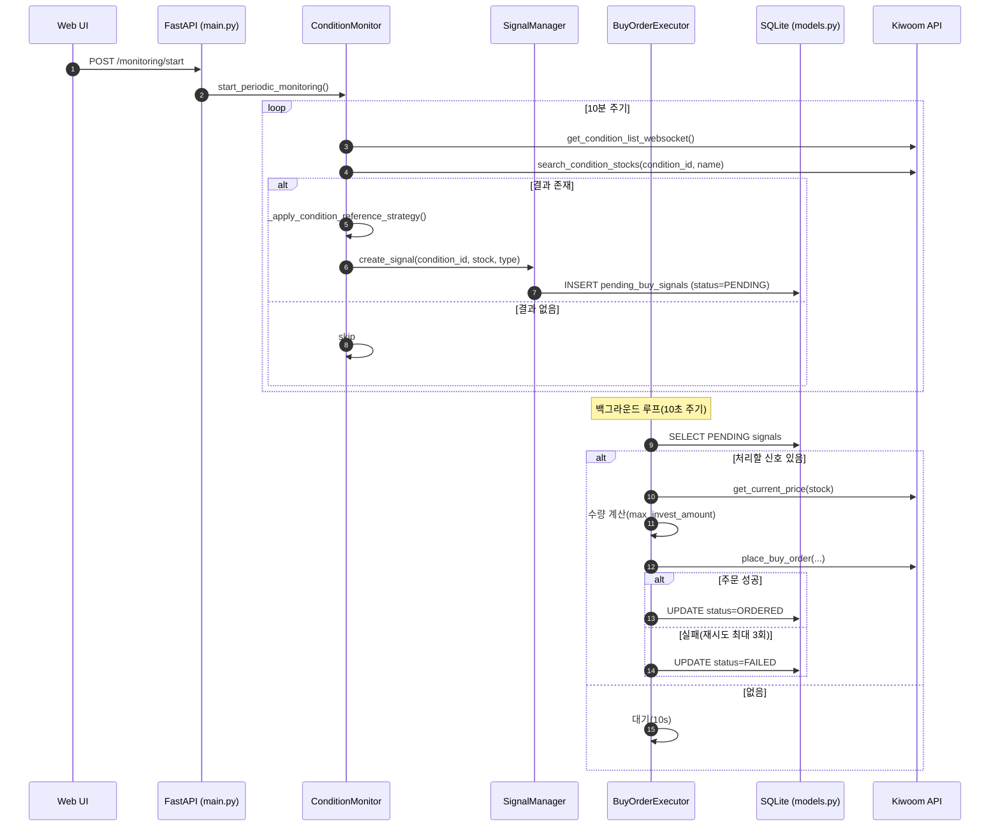
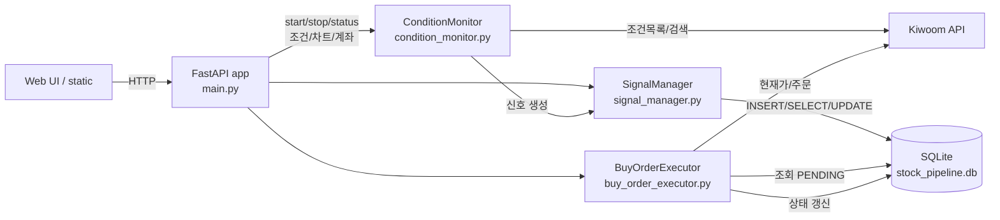

## 시스템 데이터/프로세스 흐름 개요

- **주요 컴포넌트**
  - `main.py`: FastAPI 서버 및 엔드포인트, 앱 수명주기, 정적 리소스 제공
  - `condition_monitor.py`: 조건식 주기 스캔, 기준봉 전략, 신호 생성
  - `signal_manager.py`: 신호 중복 방지, DB 저장/통계, 상태 업데이트
  - `buy_order_executor.py`: PENDING 신호 처리, 검증/주문/재시도, 상태 갱신
  - `models.py`: SQLite/SQLAlchemy 모델 및 세션, 테이블 초기화
  - `kiwoom_api.py`: 키움 API 인증/차트/시세/주문 호출 (REST/WebSocket)

---

## 상위 수준 시퀀스 (모니터링 시작 → 신호 생성 → 주문 처리)

---

## 컴포넌트 간 데이터 흐름 (C4/컨텍스트 관점)

---

## 데이터 모델 스냅샷

- `pending_buy_signals`
  - id, condition_id, stock_code, stock_name, detected_at, status(PENDING/ORDERED/FAILED/...), signal_type(condition/reference)
  - reference_candle_high, reference_candle_date, target_price
  - Unique: (condition_id, stock_code, status)

- `auto_trade_conditions`
  - id, condition_name(UNIQUE), api_condition_id, is_enabled, updated_at

- `auto_trade_settings`
  - id, is_enabled, max_invest_amount, stop_loss_rate, take_profit_rate, updated_at

---

## 주요 엔드포인트와 내부 처리

### 모니터링 관리
- **POST /monitoring/start**: `ConditionMonitor.start_periodic_monitoring` 시작 → 10분 간격 스캔 → 신호 생성
- **POST /monitoring/stop**: 모니터링 중지 및 WebSocket 종료
- **GET /monitoring/status**: 통합 상태 조회 (모니터링/신호/API제한/실행기 상태)

### 신호 관리
- **GET /signals/pending**: DB에서 신호 조회 + 실시간 현재가 보강
- **GET /signals/statistics**: 신호 통계 및 히스토리 조회

### 조건식 관리
- **GET /conditions/**: 조건식 목록 조회 (키움 API)
- **GET /conditions/{id}/stocks**: 특정 조건식의 종목 조회
- **POST /conditions/toggle**: 조건식 활성화/비활성화 토글

### 자동매매 설정
- **GET /trading/settings**: 자동매매 설정 조회
- **POST /trading/settings**: 자동매매 설정 업데이트
- **GET /buy-executor/status**: 백그라운드 주문 실행기 상태/제어

### 차트 및 분석
- **GET /chart/image/{stock_code}**: 종목 차트 이미지 생성
- **GET /kiwoom/account**: 계좌 정보 조회
- **GET /kiwoom/balance**: 잔고 조회
- **GET /stocks/{stock_code}/info**: 종목 정보 및 토론 크롤링

### 시스템 상태
- **GET /api/status**: API 연결 상태 체크
- **GET /api/rate-limit-status**: API 제한 상태 상세 조회

---

## 에러/레이트리미트 고려사항

- `api_rate_limiter`: API 호출 가용성 확인/기록, 429/제한 시 딜레이 및 일부 작업 스킵
- `ConditionMonitor` 기준봉 전략: 데이터 부족/제한 시 스킵 및 재시도 지연
- `BuyOrderExecutor` 주문: 실패 시 최대 3회 재시도, 간격 30초

---

## 로그/운영 포인트

- 앱 수명주기에서: 인증 → WebSocket 연결 시도 → `BuyOrderExecutor` 시작 → 종료 시 우아한 정리
- 주요 로그 태그: [STARTUP], [STATIC], [API], [CONDITION_MONITOR], [SIGNAL_MANAGER], [BUY_EXECUTOR]

---

## 참고 코드 위치

- FastAPI 및 엔드포인트: `main.py`
- 모니터링 로직: `condition_monitor.py`
- 신호 저장/중복 방지: `signal_manager.py`
- 주문 실행기: `buy_order_executor.py`
- 테이블/세션: `models.py`
