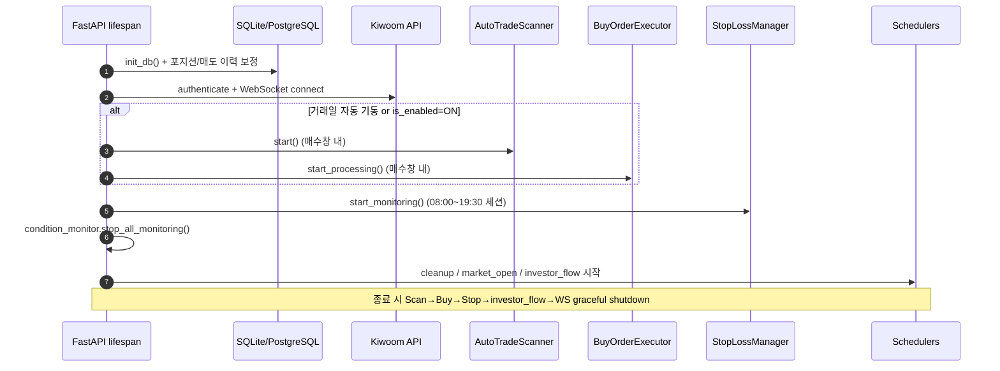
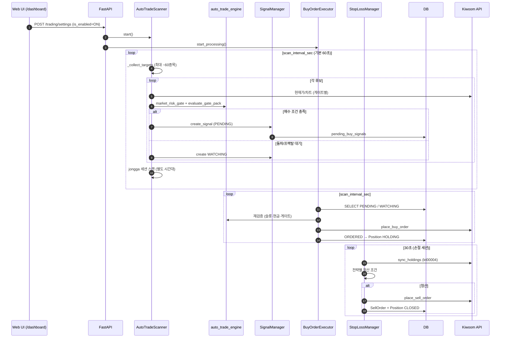
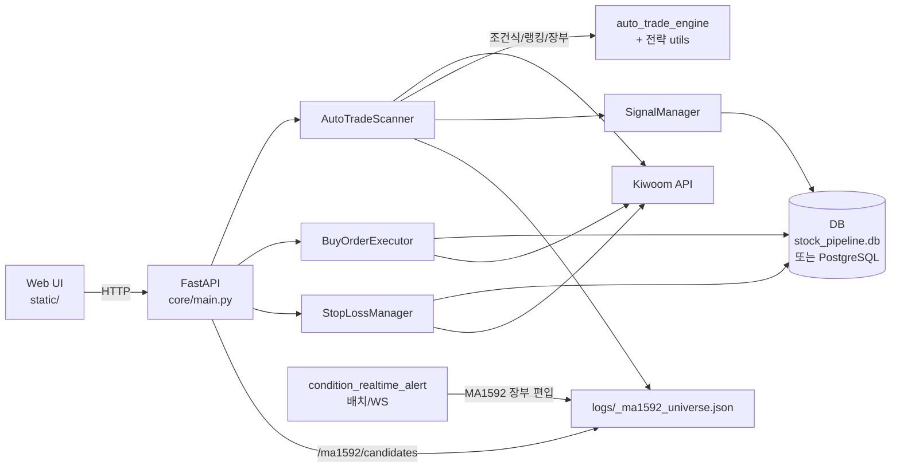

## 시스템 데이터/프로세스 흐름 개요

> **2026-08 기준.** 프로덕션 자동매매 경로는 `ConditionMonitor` 주기 검색이 아니라 **`AutoTradeScanner` → 게이트 → `BuyOrderExecutor` → `StopLossManager`** 입니다.

---

## 디렉터리 구조 (주요 컴포넌트)

| 역할 | 경로 |
|------|------|
| FastAPI 서버·수명주기·엔드포인트 | `core/main.py` |
| 환경설정 | `core/config.py` |
| DB 모델·세션 | `core/models.py` |
| **자동매매 스캐너** (핵심) | `managers/auto_trade_scanner.py` |
| 매수 주문 실행기 | `managers/buy_order_executor.py` |
| 손절/익절·장마감 청산 | `managers/stop_loss_manager.py` |
| 신호 저장·중복 방지 | `managers/signal_manager.py` |
| 조건식 주기 검색 (레거시, 기본 OFF) | `managers/condition_monitor.py` |
| 장 시작 자동 ON 스케줄러 | `managers/market_open_scheduler.py` |
| 자정 신호 정리 | `managers/cleanup_scheduler.py` |
| 수급 스냅샷 (외인/기관) | `managers/investor_flow_scheduler.py` |
| 키움 API | `api/kiwoom_api.py` |
| API 레이트리미터 | `api/api_rate_limiter.py` |
| 게이트·슬롯·사이징 공통 | `utils/auto_trade_engine.py` |
| 시장 리스크 게이트 | `utils/market_risk_gate.py` |
| HTS 조건식 조회 | `utils/screener_targets.py` |
| 전략 엔진 | `utils/jongga_engine.py`, `utils/ma1592.py`, `utils/ema_fractal.py`, `utils/program_net_continuation.py`, `utils/legacy_ema_exit.py` |
| 알림 | `notifications/trade_alert.py`, `condition_alert.py`, `condition_realtime_alert.py`, … |
| 배치 스크립트 | `scripts/*.py`, `scripts/*.bat`, `scripts/*.ps1` |
| 대시보드 UI | `static/dashboard.html`, `static/modules/*.js` |

**레거시 (엔드포인트만 존재, 부팅 시 자동 기동 안 함):**
- `managers/strategy_manager.py` — MOMENTUM/RSI 등 관심종목 전략
- `managers/scalping_strategy.py` — 구 스캘핑
- `managers/watchlist_sync_manager.py` — 조건식→관심종목 동기화
- **역매공파(ymgp)** — 스캐너·UI에서 제거, 리플레이·과거 포지션 라벨만 유지

---

## 서버 시작 / 수명주기 (`core/main.py` lifespan)



**시작 시 항상 기동:** `cleanup_scheduler`, `market_open_scheduler`, `investor_flow_scheduler`

**`AutoTradeSettings.is_enabled` + 매수창(`auto_trade_engines_allowed`)에 따라 기동:**
- `auto_trade_scanner` — 후보 수집·게이트·신호 생성
- `buy_order_executor` — PENDING/WATCHING 처리·주문

**자동매매 ON/OFF와 무관하게 유지 (매수창 밖에서도):**
- `stop_loss_manager` — kt00004 동기화, 손절/익절, 장마감 청산 (기본 08:00~19:30)

**부팅 시 기본 중지:**
- `condition_monitor` 주기 CNSRREQ 검색 (`POST /monitoring/start`도 400 반환 — 대시보드 자동매매 사용)

---

## 상위 수준 시퀀스 (통합 자동매매)



---

## 컴포넌트 간 데이터 흐름



---

## 스캐너 → 게이트 → 매수 → 청산

```
1. 후보 수집 (_collect_targets)
   ├─ 관심종목 (대시보드 textarea)
   ├─ sangtta   : ka10027 등락률상위 → 거래대금 필터
   ├─ breakout  : HTS breakout_condition_names
   ├─ fractal   : HTS fractal_condition_names + WATCHING 스티키
   ├─ ma1592    : HTS ma1592_condition_names → L3 장부 (logs/_ma1592_universe.json)
   └─ legacy    : 잔여 슬롯 ka10030 거래대금상위 + 관심종목

2. 종목별 평가 (_evaluate_and_signal)
   ├─ 보유/PENDING/WATCHING/쿨다운 스킵
   ├─ market_risk_gate (지수 급락·급등 차단)
   ├─ 전략 슬롯·매수 시간대
   └─ evaluate_gate_pack / check_entry_gate

3. 신호
   ├─ PENDING  → BuyOrderExecutor 즉시 처리 대상
   └─ WATCHING → MA20 유예·진입 확인·프랙탈 재관찰 (BuyOrderExecutor가 재게이트)

4. 매수 (BuyOrderExecutor)
   ├─ 슬롯·일일한도·현금 재검증
   ├─ Kiwoom 매수 주문
   └─ Position HOLDING + PositionBuyFill

5. 청산 (StopLossManager, 30초)
   ├─ kt00004 잔고 동기화
   ├─ 전략별 exit (고정%, 트레일, EMA, 구조이탈, MA1592 전고 반익절 등)
   └─ 장마감 청산 (overnight_keep: 당일 종가배팅 유지 · 익일 플러스/이틀 초과 종가배팅 청산)
```

---

## 활성 전략 (6종)

| key | 표시명 | 후보 소스 | 게이트 | 비고 |
|-----|--------|-----------|--------|------|
| `legacy` | 거래대금 눌림목 | 관심종목 + ka10030 | `check_entry_gate` | VWAP·일중위치·RSI·피라미딩 |
| `sangtta` | 상따 | ka10027 등락률상위 | `sangtta_breakout` | 별도 시간·슬롯·금액 |
| `breakout` | 수급 돌파 | HTS 조건식 | `oversold_breakout` | 5분 장대·MA20·프로그램 5칸 중 3칸 |
| `fractal` | 프랙탈 | HTS 조건식 | `ema_fractal_pullback` | WATCHING 최대 ~5 |
| `jongga` | 종가배팅 | 스캐너 세션 스캔 (14:30+) | `jongga_closing` | 테마 점수·돼지다리·시가 물타기 |
| `ma1592` | 15/92 홀드 | HTS 1592매매 → **스티키 장부(관찰)** | `ma1592_hold` / `ma1592_scale` | 1차=3분 가격선행 15% → 2차=15분 이격 35% → 3차=15분 EMA92유지+15선눌림 50% |

상세 PRD: `docs/PRD_*.md` 참고.

---

## 조건식 모니터링 vs 텔레그램 알림

| 구분 | 경로 | 매수 신호 생성 | 기본 상태 |
|------|------|----------------|-----------|
| **조건식 주기 검색** | `managers/condition_monitor.py` | 예 (레거시) | **OFF** (부팅·`/monitoring/start` 차단) |
| **조건식 스냅샷 알림** | `scripts/condition_telegram_alert.py` | 아니오 (Telegram만) | Task Scheduler (장중 매시) |
| **조건식 실시간 편입** | `--realtime` → `condition_realtime_alert.py` | 아니오 | Task (08:50~ 장중) |
| **스캐너 내 HTS 조건** | `auto_trade_scanner` + `screener_targets` | 예 (breakout/fractal/ma1592) | 자동매매 ON 시 |

**MA1592 장부:** 실시간 편입 알림이 `upsert_from_condition`으로 `logs/_ma1592_universe.json`에 등록 → 스캐너 L3가 장부 종목만 게이트. 대시보드 `/ma1592/candidates`는 5분봉으로 EMA·전고 실시간 보강.

---

## Windows 배치 / 알림 파이프라인

(`utils/batch_scheduler_status.py` — 대시보드 `/batch-status`)

| 시간 (기본) | 작업 | 설명 |
|-------------|------|------|
| 평일 07:55~08:20 | 장전 서버 감시 | 08:00 손절 전 서버 기동 확인 |
| 매일 08:00 | 일일 서버 기동 | FastAPI lifespan → 자동매매 |
| 평일 08:50+ | 조건식 실시간 알림 | REAL 편입 Telegram |
| 장중 매시 (12:00~) | 조건식 스냅샷 | HTS 조건 종목 Telegram |
| 평일 15:42 | 매수 실패 리포트 | FAILED 신호 Telegram |
| 매일 18:00 | 테마/키워드 마트 | Naver·Alphasquare → DB |
| 매일 18:00 | 기본적분석 마트 | Naver fundamentals → DB |
| 평일 19:50 | 키움↔DB 손익 동기화 | NXT 마감 후 실현손익·수수료 |
| 평일 19:52 | 장마감 매매 일지 | 당일 체결 Telegram |

**프로세스 내 (Task 아님):** `investor_flow_scheduler` (5분), `cleanup_scheduler` (자정), `market_open_scheduler` (30초), 종가배팅 후보 Telegram (`jongga_candidates_notify`).

---

## 데이터베이스

- **기본:** SQLite `{PROJECT_ROOT}/stock_pipeline.db`
- **선택:** PostgreSQL (`DATABASE_URL` in `.env`)
- **시작 시:** `init_db()` + 경량 컬럼 마이그레이션

### 핵심 테이블

| 테이블 | 용도 |
|--------|------|
| `auto_trade_settings` | 단일 행 — 전략 ON/OFF, 슬롯, 시간대, 게이트 파라미터 전체 |
| `pending_buy_signals` | PENDING / WATCHING / ORDERED / FAILED + `additional_data`(전략 메타 JSON) |
| `positions` | HOLDING / CLOSED, strategy, peak, buy_time |
| `position_buy_fills` | 매수 체결 이력 |
| `sell_orders` | 매도 주문·체결 |
| `auto_trade_conditions` | 레거시 condition_monitor용 |
| `watchlist_stocks` | 관심종목 (레거시 strategy_manager) |
| `krx_holidays` | 거래일 달력 |
| theme/fundamental marts | `theme_tags`, `theme_score_daily`, `fundamental_snapshots`, … |

### 파일 기반 상태 (DB 외)

| 파일 | 용도 |
|------|------|
| `logs/_ma1592_universe.json` | MA1592 L2/L3 스티키 장부 |
| `logs/_jongga_state.json` | 종가배팅 세션 상태 |
| `logs/_investor_flow_snapshot.json` | 수급 스냅샷 |

---

## 주요 API 엔드포인트

### 페이지 (HTML)

| 경로 | 파일 |
|------|------|
| `/dashboard` | `static/dashboard.html` |
| `/theme-map` | `static/theme_map.html` |
| `/verify` | `static/verify.html` |
| `/analysis` | `static/analysis.html` |
| `/exit-replay` | `static/exit_replay.html` |
| `/glossary` | `static/glossary.html` |
| `/login` | `static/login.html` |
| `/status` | `static/server_status.html` |

### 자동매매 제어·상태

- `GET/POST /trading/settings` — 마스터 ON/OFF + 전략 파라미터
- `GET /trading/readiness`, `GET /trading/activity-log`
- `GET /monitoring/status` — 스캐너·매수·손절·API 제한 통합 상태
- `GET /buy-executor/status`, `POST /buy-executor/start|stop`
- `GET /stop-loss/status`, `POST /stop-loss/start|stop|reconcile`

### 신호·포지션·성과

- `GET /signals/pending`, `GET /signals/statistics`
- `GET /positions/`, `GET /positions/intraday-sparklines`
- `GET /sell-orders/`, `GET /performance/stats`
- `POST /trading/buy`, `POST /positions/{id}/manual-sell|manual-avg-down`

### 전략 후보 (대시보드 미리보기)

- `GET /screener/candidates` (legacy)
- `GET /sangtta/candidates`, `/breakout/candidates`, `/fractal/candidates`
- `GET /ma1592/candidates` — 장부 + 5분봉 EMA·전고 보강
- `GET /jongga/candidates`, `POST /jongga/pick`

### 계좌·시장·테마

- `GET /account/balance|holdings|profit`
- `GET /market/indices`
- `GET /theme-map/*`, `POST /theme-map/refresh|manual/...`
- `GET /batch-status`

### 검증·텔레그램

- `GET /api/strategy-day-verify`, `GET /verification/trades|chart`
- `GET /telegram/status`, `POST /telegram/send-now`

### 레거시 (수동 opt-in, 자동매매 경로 아님)

- `POST /strategy/start|stop`, `GET /strategy/status`
- `POST /scalping/start|stop`, `GET /scalping/status`
- `POST /watchlist/sync/start|stop`
- `POST /monitoring/start` → **400** (조건식 주기 검색 중단 안내)

---

## BuyOrderExecutor / StopLossManager 요약

### BuyOrderExecutor (`managers/buy_order_executor.py`)
- `scan_interval_sec` 주기 (15~600, 기본 60)
- **PENDING** 먼저, **WATCHING** (돌파/프랙탈) 재게이트 후 승격
- 일시 오류(시세·잔고·레이트리미트·MA20 유예) → 재시도, 즉시 FAILED 아님
- `is_enabled=false` 또는 매수창 밖 → 미동작
- ymgp WATCHING → `"역매공파 전략 폐기"` 로 만료

### StopLossManager (`managers/stop_loss_manager.py`)
- **30초** 주기, 기본 **08:00~19:30** (자동매매 ON/OFF 무관)
- kt00004 잔고 동기화 → DB 포지션 정합
- 전략별 청산 분기 (고정손절, 트레일, legacy EMA, breakout 구조, sangtta soft, jongga, ma1592 전고·impulse 등)
- 장마감 `_run_market_close_liquidation` + `utils/overnight_keep.py`

---

## 에러 / 레이트리미트

- `api/api_rate_limiter.py` — 분당 호출 한도, 최소 간격, LIMITED 시 대기
- `AutoTradeScanner.compute_scan_throttle_sec` — API 여유에 따라 종목 간 pause 조절
- 차트 `cache_ttl_sec` — 전략별 TTL (예: MA1592 `MA1592_CHART_CACHE_TTL`)
- `BuyOrderExecutor` — transient 실패 재시도 (최대 3회 등)
- `StopLossManager` — 매도 수량 부족(800033), 중복 보유, 매수 결제 대기 grace

---

## 로그 / 운영 포인트

- 앱 수명주기: DB → Kiwoom 인증/WS → `apply_auto_trade_state` → 손절 루프 → 스케줄러 3종
- 활동 로그: `utils/auto_trade_activity_log.py` → `/trading/activity-log`
- 전략별 파일 로그: `[AUTO_SCANNER]`, `[MA1592]`, `[JONGGA]`, `[BUY_EXECUTOR]`, `[STOP_LOSS]`
- 서버 트레이·자동 종료: `SERVER_AUTO_SHUTDOWN_TIME` (기본 19:30), `scripts/ensure_server_running.ps1`

---

## 참고 코드·문서

| 주제 | 위치 |
|------|------|
| FastAPI·수명주기 | `core/main.py` |
| 자동매매 스캐너 | `managers/auto_trade_scanner.py` |
| 게이트·슬롯 | `utils/auto_trade_engine.py` |
| MA1592 | `utils/ma1592.py`, `docs/PRD_MA1592.md` |
| 종가배팅 | `utils/jongga_engine.py`, `docs/PRD_JONGGA_BETTING.md` |
| 프랙탈 | `utils/ema_fractal.py`, `docs/PRD_Williams_Fractal_EMA_Scalping.md` |
| 수급 돌파 | `docs/PRD_OVERSOLD_BREAKOUT.md` |
| 상따 | `docs/PRD_SANGTTA_BREAKOUT.md` |
| 테마 | `docs/PRD_ALPHASQUARE_THEME.md` |
| 배치 상태 | `utils/batch_scheduler_status.py` |

---

## 폐기 / 레거시 (문서·신규 개발 시 제외)

| 항목 | 상태 |
|------|------|
| **역매공파 (ymgp)** | 스캐너·설정 UI 제거. `utils/ymgp_engine.py`는 exit-replay용 |
| **ConditionMonitor 주기 검색** | 프로덕션 경로 아님. `/monitoring/start` 차단 |
| **StrategyManager** (MOMENTUM/RSI/…) | API만 유지, 부팅 미기동 |
| **ScalpingStrategy** | fractal로 대체, API만 유지 |
| **WatchlistSync** | API만 유지 |
| **기준봉(reference candle) 전략** | ConditionMonitor에서 제거 |
| **stock_news 배치** | 스케줄 비활성 |
